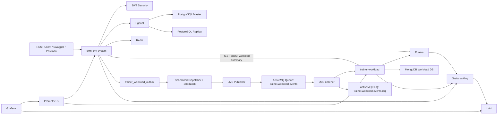

# Gym CRM Microservices

Gym CRM is a Spring Boot microservices training project for managing gym
trainees, trainers, trainings, authentication, trainer workload summaries,
monitoring, and resilience scenarios.

This is a monorepo. GitLab renders this root `README.md` as the project
documentation.

## Modules

* `gym-crm-system` - main service. Manages trainees, trainers, trainings,
  authentication, PostgreSQL persistence, Redis-backed security state, metrics,
  and integration with trainer workload.
* `trainer-workload` - workload service. Stores trainer monthly workload
  summaries in MongoDB, consumes workload update messages from ActiveMQ, and
  exposes a REST query endpoint for summaries.
* `eureka` - Spring Cloud Netflix Eureka discovery server.
* `infra` - PostgreSQL initialization scripts and Prometheus/Grafana
  configuration.
* `docker-compose.yml` - local deployment model for all services.

## Architecture



## Key Features

* Trainee and trainer profile creation, authentication, profile updates, status
  switching, and password changes.
* Training creation, deletion, and training history queries.
* Trainer assignment for trainees.
* Stateless JWT bearer authentication.
* Redis-backed failed login attempt tracking and JWT revocation.
* Spring Data JPA persistence for the main service.
* Spring Data MongoDB persistence for `trainer-workload`.
* Eureka service discovery.
* Service-to-service JWT for internal workload summary queries.
* ActiveMQ-based trainer workload update delivery.
* Custom outbox retry flow for failed workload message publishing.
* ShedLock for single-node execution of the scheduled outbox dispatcher in
  multi-replica deployments.
* Dead-letter queue handling for workload messages that cannot be processed
  after configured redeliveries.
* Idempotency records in `trainer-workload` to ignore duplicate workload
  events.
* Correlation-id based tracing through `X-Transaction-Id`, JMS
  `transactionId`, and log pattern `tx:<id>`.
* Centralized log collection with Grafana Alloy, Loki, and Grafana Explore.
* Actuator, Prometheus, and Grafana monitoring.
* Maven, JUnit, Mockito, Testcontainers, Checkstyle, and JaCoCo verification.

## Requirements

* Java 25
* Maven 3.9+
* Docker or Podman with Docker-compatible CLI
* Optional: Newman for running Postman collections from terminal

## Local Environment

Create `.env` from the example file.

Linux/macOS:

```bash
cp .env.example .env
```

PowerShell:

```powershell
Copy-Item .env.example .env
```

The committed `.env.example` contains local demo values only. Real secrets
should stay in ignored `.env` files.

## Run The Full Stack

Linux/macOS:

```bash
docker compose up -d --build
```

PowerShell:

```powershell
docker compose up -d --build
```

Podman:

```powershell
podman compose up -d --build
```

The application Dockerfiles copy already-built jars from each module's
`target` directory. After changing Java code, package the affected services
before rebuilding images.

PowerShell:

```powershell
Push-Location gym-crm-system
mvn -DskipTests package
Pop-Location

Push-Location trainer-workload
mvn -DskipTests package
Pop-Location

podman compose up -d --build --force-recreate gym-app trainer-workload
```

Check containers.

Linux/macOS:

```bash
docker compose ps
```

PowerShell:

```powershell
docker compose ps
```

Podman:

```powershell
podman compose ps
```

Useful URLs:

```text
Eureka:                    http://localhost:8761
Gym CRM Swagger UI:        http://localhost:8080/api/swagger-ui.html
Trainer Workload Swagger:  http://localhost:8081/api/swagger-ui/index.html
ActiveMQ Console:          http://localhost:8161/admin/  admin/admin
MongoDB:                   http://localhost:27017 database trainer_workload
MongoDB Exporter metrics:  http://localhost:9216/metrics
Gym CRM health:            http://localhost:8080/api/actuator/health
Trainer Workload health:   http://localhost:8081/api/actuator/health
Prometheus:                http://localhost:9090
Grafana:                   http://localhost:3000
Loki:                      http://localhost:3100
Grafana Alloy:             http://localhost:12345
```

## Build And Verify

Run verification per service.

Linux/macOS:

```bash
cd gym-crm-system
mvn clean verify
cd ..
```

```bash
cd trainer-workload
mvn clean verify
cd ..
```

```bash
cd eureka
mvn clean verify
cd ..
```

PowerShell:

```powershell
Push-Location gym-crm-system
mvn clean verify
Pop-Location
```

```powershell
Push-Location trainer-workload
mvn clean verify
Pop-Location
```

```powershell
Push-Location eureka
mvn clean verify
Pop-Location
```

## Main API

Public endpoints:

```text
POST /api/v1/trainees
POST /api/v1/trainers
POST /api/v1/auth/login
```

Protected endpoints require:

```http
Authorization: Bearer <token>
```

Swagger UI:

```text
http://localhost:8080/api/swagger-ui.html
```

OpenAPI JSON:

```text
http://localhost:8080/api/v3/api-docs
```

## Trainer Workload API

Swagger UI:

```text
http://localhost:8081/api/swagger-ui/index.html
```

OpenAPI JSON:

```text
http://localhost:8081/api/v3/api-docs
```

`trainer-workload` endpoints are protected with the same JWT issuer/secret.
The main service calls the workload summary query endpoint with a service JWT.
Workload updates are not sent through REST; they are consumed from ActiveMQ.

## Trainer Workload MongoDB

`trainer-workload` stores read-optimized trainer workload documents in MongoDB.
Each trainer is stored as one document in `trainer_workloads`, keyed by trainer
username. Year and month summaries are embedded inside that document.

The service also stores processed event records in
`trainer_workload_processed_events`. A unique MongoDB compound index on
`trainingId` and `actionType` protects the listener from applying the same
training event twice.

Local connection settings:

```text
Container hostname: gym-mongo
Host port:          localhost:27017
Database:           trainer_workload
Application env:    TRAINER_WORKLOAD_MONGODB_URI
Spring property:    spring.mongodb.uri
Exporter:           gym-mongodb-exporter:9216
```

Inspect stored workload documents from the host:

```powershell
podman exec gym-mongo mongosh trainer_workload --quiet --eval "db.trainer_workloads.find().pretty()"
```

Inspect processed event idempotency records:

```powershell
podman exec gym-mongo mongosh trainer_workload --quiet --eval "db.trainer_workload_processed_events.find().pretty()"
```

Inspect Mongo indexes:

```powershell
podman exec gym-mongo mongosh trainer_workload --quiet --eval "db.trainer_workloads.getIndexes(); db.trainer_workload_processed_events.getIndexes();"
```

## Messaging And Outbox Flow

When a training is created or deleted, `gym-crm-system` sends a workload update
to `trainer-workload` through the outbox and ActiveMQ.

Command/update flow:

```text
training operation
-> trainer_workload_outbox PENDING record
-> scheduled dispatcher with ShedLock
-> ActiveMQ queue trainer.workload.events
-> trainer-workload JMS listener
-> MongoDB workload summary updated
-> outbox status SENT
```

Query/read flow:

```text
GET workload summary
-> gym-crm-system REST client
-> trainer-workload GET /v1/trainer-workloads/{username}
-> MongoDB-backed response DTO
```

If ActiveMQ is unavailable, training operations still succeed and outbox
records remain `PENDING`. The scheduled dispatcher retries later. If
`trainer-workload` receives a message but cannot process it after the configured
redeliveries, the listener moves the payload to
`trainer.workload.events.dlq` with failure metadata.

The retry dispatcher is protected by ShedLock, so only one `gym-crm-system`
replica dispatches outbox records at a time. The workload service stores
processed `(trainingId, actionType)` events in MongoDB, making retries
idempotent.

## Logs And Tracing

Both services log `X-Transaction-Id` or JMS `transactionId` as `tx:<id>`.

Example:

```text
[tx:demo-001] ... REST request started ...
```

This is correlation-id based tracing through logs. It is not a full
OpenTelemetry/Zipkin/Jaeger distributed tracing setup.

Logs are centralized in Loki and queried from Grafana. Grafana Alloy reads the
service log volumes and sends log entries to Loki with stable labels such as
`service`, `job`, and `env`. `transactionId` is intentionally kept inside the
log message instead of being used as a Loki label, because every request can
have a different value.

Open Grafana Explore:

```text
http://localhost:3000/explore
```

Select the `Loki` data source and search across application services.

Find errors:

```logql
{service=~"gym-crm-system|trainer-workload"} |= "ERROR"
```

Find a full request flow after copying `tx:<id>` from any log line:

```logql
{service=~"gym-crm-system|trainer-workload"} |= "tx:demo-001"
```

Include Eureka logs if needed:

```logql
{job="gym-crm"} |= "tx:demo-001"
```

Follow logs.

Linux/macOS:

```bash
docker logs -f gym-app
```

```bash
docker logs -f gym-trainer-workload
```

PowerShell:

```powershell
docker logs -f gym-app
```

```powershell
docker logs -f gym-trainer-workload
```

Podman:

```powershell
podman logs -f gym-app
```

```powershell
podman logs -f gym-trainer-workload
```

## ActiveMQ

Open the ActiveMQ console:

```text
http://localhost:8161/admin/
admin / admin
```

The main workload queue is:

```text
trainer.workload.events
```

The application-level dead-letter queue is:

```text
trainer.workload.events.dlq
```

Useful broker checks:

```powershell
curl.exe -u admin:admin -H "Origin: http://localhost:8161" "http://localhost:8161/api/jolokia/read/org.apache.activemq:type=Broker,brokerName=localhost/CurrentConnectionsCount,TotalConsumerCount,TotalProducerCount,Queues"
```

```powershell
curl.exe -u admin:admin -H "Origin: http://localhost:8161" "http://localhost:8161/api/jolokia/read/org.apache.activemq:brokerName=localhost,destinationName=trainer.workload.events,destinationType=Queue,type=Broker/ConsumerCount,QueueSize,EnqueueCount,DequeueCount"
```

## Postman

Postman collections:

```text
gym-crm-system/postman/gym-crm-rest.postman_collection.json
gym-crm-system/postman/gym-crm-outbox.postman_collection.json
gym-crm-system/postman/gym-crm-activemq-load.postman_collection.json
gym-crm-system/postman/gym-crm-log-volume-demo.postman_collection.json
```

Optional Newman run:

Linux/macOS:

```bash
newman run ./gym-crm-system/postman/gym-crm-outbox.postman_collection.json
```

PowerShell:

```powershell
newman run .\gym-crm-system\postman\gym-crm-outbox.postman_collection.json
```

Generate ActiveMQ workload messages and inspect queue metrics:

```powershell
newman run .\gym-crm-system\postman\gym-crm-activemq-load.postman_collection.json
```

Generate log activity for Loki/Grafana checks:

Linux/macOS:

```bash
newman run ./gym-crm-system/postman/gym-crm-log-volume-demo.postman_collection.json
```

PowerShell:

```powershell
newman run .\gym-crm-system\postman\gym-crm-log-volume-demo.postman_collection.json
```

## Monitoring

Actuator endpoints:

```text
http://localhost:8080/api/actuator/health
http://localhost:8080/api/actuator/metrics
http://localhost:8080/api/actuator/prometheus
http://localhost:8081/api/actuator/health
http://localhost:8081/api/actuator/prometheus
```

Prometheus scrapes `gym-crm-system` and `trainer-workload` actuator metrics,
plus MongoDB metrics through `gym-mongodb-exporter`.

MongoDB exporter metrics:

```text
http://localhost:9216/metrics
```

Prometheus:

```text
http://localhost:9090
```

Grafana:

```text
http://localhost:3000
```

Default local Grafana credentials are configured in `.env.example`:

```text
admin / admin
```
