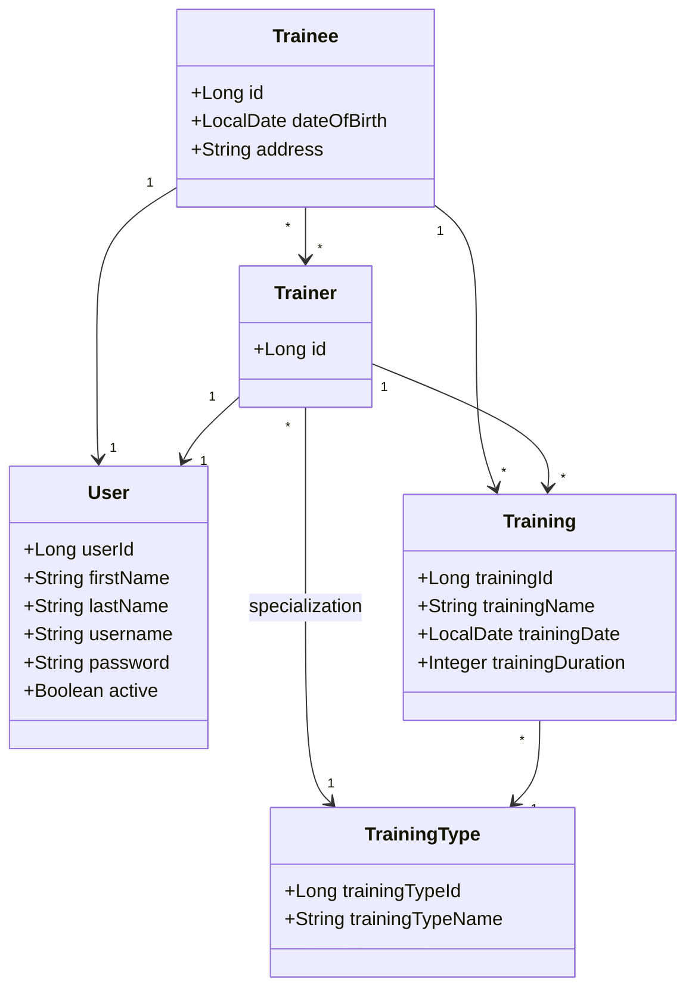

# Gym CRM

Gym CRM is a Spring-based backend application for managing gym trainees, trainers, training types, and training sessions. Persistence is implemented with Hibernate/JPA and PostgreSQL.

## Features

* **Trainee and trainer profiles:** create, read by username, update, switch active status, and authenticate profiles.
* **Generated credentials:** usernames are generated from first and last names, and passwords are generated for new profiles.
* **Password changes:** authenticated trainees and trainers can change their passwords.
* **Training management:** add trainings and query trainee/trainer training lists with date and name/type criteria.
* **Trainer assignment:** list trainers not assigned to a trainee and replace a trainee's trainer list.
* **Hibernate persistence:** entity relationships are mapped with JPA annotations and executed through DAO/service layers.
* **Testing and coverage:** unit and integration tests run with Maven, JUnit, Mockito, Testcontainers, and JaCoCo.

## Requirements

* Java 25
* Maven 3.9+
* Podman or Docker for the local database stack

## Build And Test

Run the full verification lifecycle:

```bash
mvn verify
```

This compiles the project, runs all tests, generates the JaCoCo report, and enforces the configured coverage checks.

## Local Application Run

The application reads database settings from Spring properties. For a direct Maven run, provide a root `.env` file or equivalent environment variables with:

```env
db.url=jdbc:postgresql://localhost:5435/gym_crm
db.username=gym_user
db.password=password
db.driver=org.postgresql.Driver
```

Then run:

```bash
mvn -q -DskipTests exec:java -Dexec.mainClass=com.epam.gymcrm.Main
```

The current application starts a Spring context and then exits; it is not a web server.

## Containerized Database Stack

The `infra` compose stack starts the database infrastructure used by local application runs:

* PostgreSQL master on host port `5433`
* PostgreSQL replica on host port `5434`
* Pgpool on host port `5435`

Create a local compose environment file:

```bash
cp infra/.env.example infra/.env
```

Start the full stack:

```bash
cd infra
podman compose up -d
```

If old volumes were created with previous credentials or schema settings, reset them first:

```bash
podman compose down -v
podman compose up -d
```

After the stack is running, the application can connect to Pgpool through:

```env
db.url=jdbc:postgresql://localhost:5435/gym_crm
db.username=gym_user
db.password=password
db.driver=org.postgresql.Driver
```

## Optional Application Image

The root `Dockerfile` can build an application image for smoke checks or future long-running entry points:

```bash
podman build -t gym-crm:local .
```

The image receives database configuration at runtime through:

```env
DB_URL
DB_USERNAME
DB_PASSWORD
DB_DRIVER
```

These values are not baked into the Docker image. Since the current application only starts a Spring context and exits, it is intentionally not part of the compose stack until a long-running interface, such as REST, is added.

The committed `infra/.env.example` contains local sample values only; real local secrets should stay in ignored `.env` files.

## Architecture

The project follows a layered structure:

* **Facade:** `GymFacade` exposes application operations.
* **Services:** business logic, validation, authentication checks, and transaction boundaries.
* **DAOs:** Hibernate/JPA persistence operations through `EntityManager`.
* **Models:** JPA entities for `User`, `Trainee`, `Trainer`, `Training`, and `TrainingType`.
* **Criteria/DTOs:** request and filtering records for training queries and training creation.

### Entity Relationships



## Configuration Notes

Main Hibernate settings are in `src/main/resources/application.properties`.

Training types are seeded from `src/main/resources/data.sql` into the `training_type` table. Hibernate is currently configured with `hibernate.hbm2ddl.auto=create-drop`, so the schema is recreated during application startup.

## GitLab CI

The GitLab pipeline runs for merge requests, `main`, and `devel`.

* `verify`: runs `mvn verify`, publishes JUnit reports, and publishes the JaCoCo coverage report.
Current CI does not need database credentials, because tests use Testcontainers. Credentials are only needed if a future deploy job starts the compose stack from GitLab.
