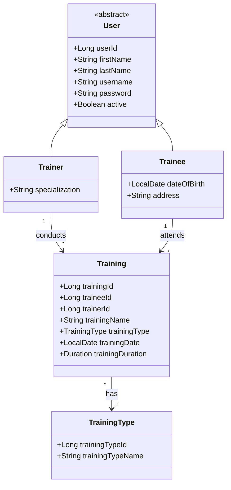
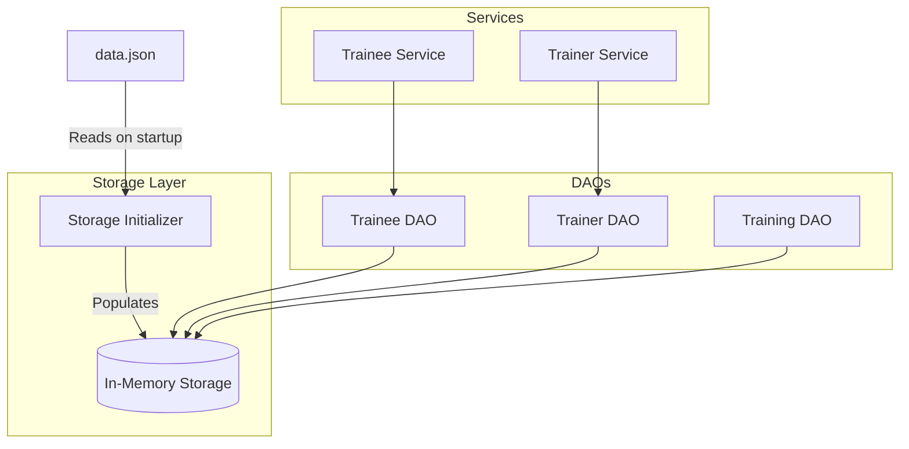
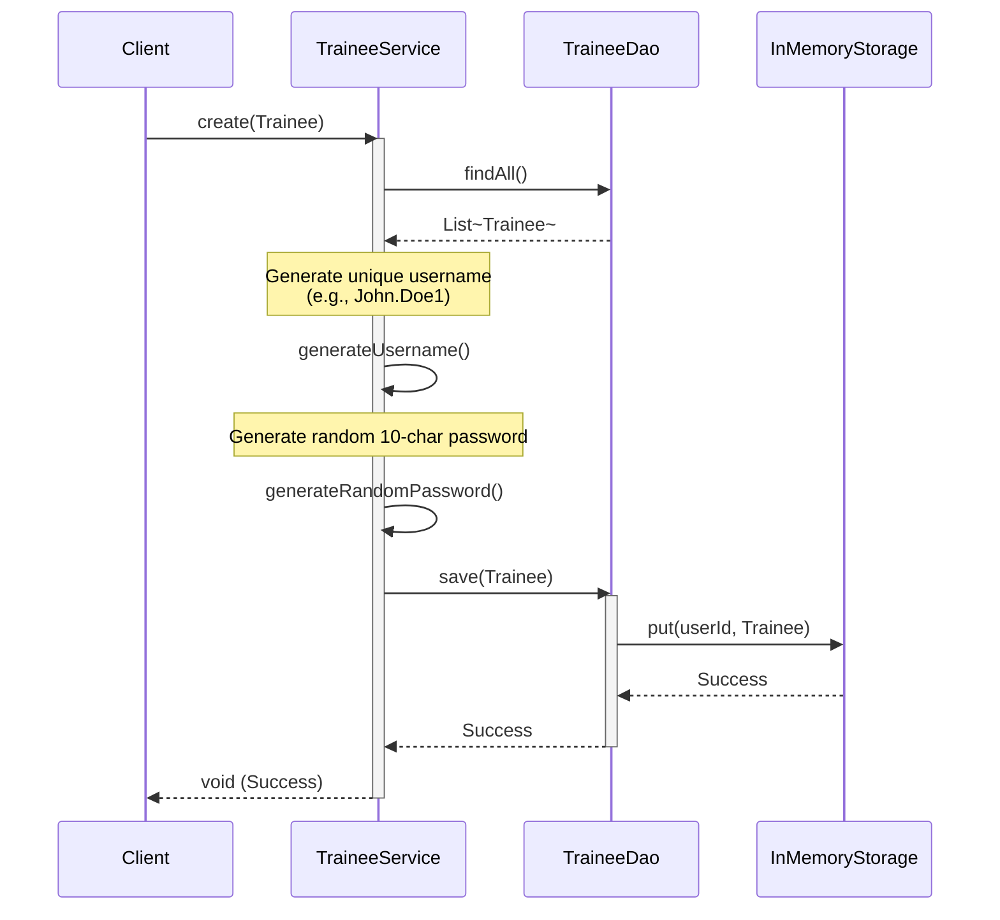

# Gym CRM

Gym CRM is a backend application designed to manage the core operations of a fitness center. Built with the Spring Framework, it provides functionalities to manage trainees, trainers, and their training sessions.

## Features

*   **User Management:** Create and manage profiles for both Trainees and Trainers.
*   **Automatic Credentials:** Auto-generates unique usernames (e.g., `FirstName.LastName`) and random passwords for new users.
*   **Training Sessions:** Schedule and manage training sessions between trainees and trainers, including tracking the training type and duration.
*   **In-Memory Storage:** Utilizes an in-memory data store for quick development and testing, pre-populated with data from a JSON file using Spring's `BeanPostProcessor`.

## Getting Started

### Prerequisites

*   Java 17 or higher
*   Maven or Gradle

### Installation

1.  Clone the repository:
    ```bash
    git clone https://git.epam.com/ihor_prokhorchuk/gym_crm.git
    cd gym_crm
    ```
2.  Build the project:
    ```bash
    ./mvnw clean install
    ```
3.  Run the application:
    ```bash
    ./mvnw spring-boot:run
    ```

## Architecture & Design

The application follows a standard layered architecture:
*   **Services:** Contain business logic (e.g., `TraineeService`, `TrainerService`).
*   **DAOs (Data Access Objects):** Handle data persistence operations.
*   **Storage:** Custom `InMemoryStorage` initialized via `StorageInitializer` reading from `data.json`.

### Class Diagram (Entity Relations)



### Component Architecture



### User Flow: Creating a New Trainee



## Configuration

Initial data is loaded from `src/main/resources/data.json` at application startup. The file path can be configured in `application.properties` using the `storage.file.path` property.
