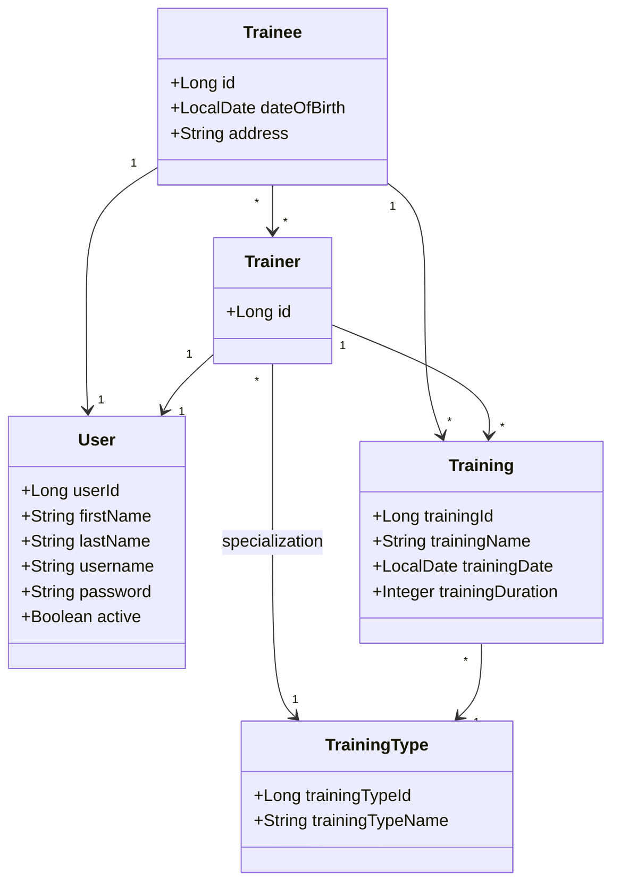

# Gym CRM

Gym CRM is a Spring Boot backend application for managing gym trainees, trainers, training types, and training sessions. Persistence is implemented with Spring Data JPA and PostgreSQL, with an H2 profile for local development.

## Features

* **Trainee and trainer profiles:** create, read by username, update, switch active status, and authenticate profiles.
* **Generated credentials:** usernames are generated from first and last names, and passwords are generated for new profiles.
* **Password changes:** authenticated trainees and trainers can change their passwords.
* **Training management:** add trainings and query trainee/trainer training lists with date and name/type criteria.
* **Trainer assignment:** list trainers not assigned to a trainee and replace a trainee's trainer list.
* **Spring Security:** stateless JWT bearer authentication, role-based access control, logout token revocation, and CORS configuration.
* **Spring Data JPA persistence:** repositories are implemented with Spring Data JPA.
* **Redis-backed security state:** failed login attempts and revoked JWT ids are stored in Redis.
* **Actuator and Prometheus:** health, metrics, and Prometheus endpoints are exposed through Spring Boot Actuator.
* **Testing and coverage:** unit and integration tests run with Maven, JUnit, Mockito, Testcontainers, and JaCoCo.

## Requirements

* Java 25
* Maven 3.9+
* Podman or Docker for the PostgreSQL/Redis compose stack and Testcontainers-based tests

## Build And Test

Run the full verification lifecycle:

```bash
mvn clean verify
```

This compiles the project, runs all tests, generates the JaCoCo report, and enforces the configured coverage checks.

Build the executable Spring Boot JAR:

```bash
mvn clean package
```

The generated artifact is:

```text
target/gym-crm-1.0-SNAPSHOT.jar
```

## Spring Profiles

The application supports three runtime profiles:

| Profile | Database | Intended use | Notes |
| --- | --- | --- | --- |
| `dev_local` | H2 in-memory | Local development without PostgreSQL | Creates schema on startup and imports `data-h2.sql`; SQL logging and health details are enabled. |
| `dev` | PostgreSQL via Pgpool | Local/dev environment with real DB | Uses `validate` DDL mode; SQL logging and health details are enabled. |
| `prod` | PostgreSQL via Pgpool | Production-like/default environment | Default profile; uses `validate` DDL mode; health details are hidden. |

The default profile is `prod`, configured through:

```properties
spring.profiles.default=prod
```

## Run With Maven

Use `dev_local` when you want to run the application without starting PostgreSQL:

```bash
mvn spring-boot:run -Dspring-boot.run.profiles=dev_local
```

On PowerShell, quote the Maven argument:

```powershell
mvn spring-boot:run "-Dspring-boot.run.profiles=dev_local"
```

Use `dev` when the PostgreSQL compose stack is running:

```bash
mvn spring-boot:run -Dspring-boot.run.profiles=dev
```

Run with the default `prod` profile by omitting the profile argument:

```bash
mvn spring-boot:run
```

Or pass it explicitly:

```bash
mvn spring-boot:run -Dspring-boot.run.profiles=prod
```

## Run The Executable JAR

First build the JAR:

```bash
mvn clean package
```

Run with H2:

```bash
java -jar target/gym-crm-1.0-SNAPSHOT.jar --spring.profiles.active=dev_local
```

Run with the real database in `dev`:

```bash
java -jar target/gym-crm-1.0-SNAPSHOT.jar --spring.profiles.active=dev
```

Run with the default `prod` profile:

```bash
java -jar target/gym-crm-1.0-SNAPSHOT.jar
```

The application starts on port `8080` by default. REST API endpoints are available under:

```text
http://localhost:8080/api/v1
```

## Authentication And Security

Public endpoints:

```text
POST /api/v1/trainees
POST /api/v1/trainers
POST /api/v1/auth/login
```

All other API endpoints require a JWT bearer token:

```http
Authorization: Bearer <token>
```

Login returns a JWT token and profile type:

```text
POST /api/v1/auth/login
```

Logout revokes the current JWT until its natural expiration:

```text
POST /api/v1/auth/logout
```

JWT tokens are valid for 30 minutes by default. The lifetime, issuer, and signing secret are
configured through environment variables:

```properties
JWT_ISSUER=https://gym-crm.local
JWT_SECRET=GymCrmLocalDevelopmentJwtSecretKeyMustBeAtLeastThirtyTwoBytes
JWT_TOKEN_LIFETIME=PT30M
```

Redis is required for security state:

* failed login attempts are counted in Redis;
* a user is temporarily blocked after 3 failed login attempts by default;
* revoked JWT ids are stored in Redis until the original token expiration time.

The default lockout settings are:

```properties
LOGIN_MAX_FAILED_ATTEMPTS=3
LOGIN_LOCK_DURATION=PT5M
```

CORS is configured through environment variables. The default local origins are suitable for common
frontend dev servers:

```properties
CORS_ALLOWED_ORIGINS=http://localhost:3000,http://localhost:5173,http://localhost:8080
CORS_ALLOWED_METHODS=GET,POST,PUT,DELETE,OPTIONS
CORS_ALLOWED_HEADERS=Authorization,Content-Type,Accept,Origin
CORS_ALLOW_CREDENTIALS=false
CORS_MAX_AGE=PT1H
```

## Infrastructure Compose Stack

The `infra` compose stack starts the database and Redis infrastructure used by the `dev` and
`prod` profiles:

* PostgreSQL master on host port `5433`
* PostgreSQL replica on host port `5434`
* Pgpool on host port `5435`
* Redis on host port `6379`

Create a local compose environment file if you want to override defaults:

```bash
cp infra/.env.example infra/.env
```

Start the infrastructure stack:

```bash
cd infra
podman compose up -d gym-master gym-replica gym-pgpool gym-redis
```

The application connects to Pgpool through these default values:

```properties
SPRING_DATASOURCE_URL=jdbc:postgresql://localhost:5435/gym_crm
SPRING_DATASOURCE_USERNAME=gym_user
SPRING_DATASOURCE_PASSWORD=password
REDIS_HOST=localhost
REDIS_PORT=6379
```

From the project root, override them when needed:

```bash
SPRING_DATASOURCE_URL=jdbc:postgresql://localhost:5435/gym_crm \
SPRING_DATASOURCE_USERNAME=gym_user \
SPRING_DATASOURCE_PASSWORD=password \
REDIS_HOST=localhost \
REDIS_PORT=6379 \
java -jar target/gym-crm-1.0-SNAPSHOT.jar --spring.profiles.active=dev
```

PowerShell example:

```powershell
$env:SPRING_DATASOURCE_URL = "jdbc:postgresql://localhost:5435/gym_crm"
$env:SPRING_DATASOURCE_USERNAME = "gym_user"
$env:SPRING_DATASOURCE_PASSWORD = "password"
$env:REDIS_HOST = "localhost"
$env:REDIS_PORT = "6379"
java -jar target/gym-crm-1.0-SNAPSHOT.jar --spring.profiles.active=dev
```

If old volumes were created with previous credentials or schema settings, reset them first:

```bash
podman compose down -v
podman compose up -d gym-master gym-replica gym-pgpool gym-redis
```

## Run With Docker Compose

Build and start the application container together with the database stack:

```bash
cd infra
podman compose up -d --build gym-app
```

The application container uses the `prod` profile by default. To run it with another profile, set `SPRING_PROFILES_ACTIVE` in `infra/.env`:

```env
SPRING_PROFILES_ACTIVE=dev
```

Then restart the application service:

```bash
podman compose up -d --build gym-app
```

Inside the compose network, the application connects to:

```properties
SPRING_DATASOURCE_URL=jdbc:postgresql://gym-pgpool:5432/gym_crm
REDIS_HOST=gym-redis
REDIS_PORT=6379
```

## Actuator And Prometheus

Actuator endpoints are exposed under:

```text
http://localhost:8080/api/actuator
```

Useful endpoints:

```text
GET /api/actuator/health
GET /api/actuator/metrics
GET /api/actuator/prometheus
```

The application includes custom health indicators:

* `applicationSchema`
* `trainingTypeCatalog`

The application also exposes custom Prometheus metrics:

* `gym_auth_login_failed_total{reason="invalid_credentials"}`
* `gym_training_creation_succeeded_total`
* `gym_training_creation_failed_total{reason="auth_failed|trainer_not_found|training_type_not_found"}`

## Grafana Monitoring

The compose stack includes Prometheus and Grafana for local monitoring.

Start the full application and monitoring stack:

```bash
cd infra
podman compose up -d --build gym-app prometheus grafana
```

Open Grafana:

```text
http://localhost:3000
```

Default local credentials are:

```text
username: admin
password: admin
```

The credentials can be changed in `infra/.env`:

```env
GRAFANA_ADMIN_USER=admin
GRAFANA_ADMIN_PASSWORD=admin
```

Prometheus is available at:

```text
http://localhost:9090
```

Prometheus scrapes Spring Boot metrics from:

```text
http://gym-app:8080/api/actuator/prometheus
```

This default setup is intended for the containerized `gym-app` service.

For a local Maven or JAR run, change the Prometheus config in `infra/.env` first:

```env
PROMETHEUS_CONFIG=prometheus-host-podman.yml
```

Use this value for Docker instead:

```env
PROMETHEUS_CONFIG=prometheus-host-docker.yml
```

Then start only the monitoring services and keep the application running on host port `8080`:

```bash
cd infra
podman compose up -d prometheus grafana
```

In this mode Prometheus scrapes the application through one host target:

```text
http://host.containers.internal:8080/api/actuator/prometheus
```

Grafana is provisioned automatically with:

* Prometheus datasource.
* `Gym CRM Overview` dashboard.

The dashboard includes application availability, HTTP request rate, JVM memory, CPU usage, Hikari connections, failed logins, successful training creation, and failed training creation by reason.

## OpenAPI Documentation

OpenAPI JSON and Swagger UI are available at:

```text
http://localhost:8080/api/v3/api-docs
http://localhost:8080/api/swagger-ui.html
```

## Architecture

The project follows a layered structure:

* **Controllers:** REST API endpoints and HTTP request/response handling.
* **Services:** business logic, validation, authentication checks, and transaction boundaries.
* **Repositories:** Spring Data JPA persistence operations.
* **Models:** JPA entities for `User`, `Trainee`, `Trainer`, `Training`, and `TrainingType`.
* **DTOs:** request and response objects for API and service operations.
* **Monitoring:** custom Actuator health indicators and Micrometer metrics.

### Entity Relationships



## Configuration Notes

Common Spring Boot settings are in:

```text
src/main/resources/application.properties
```

Profile-specific settings are in:

```text
src/main/resources/application-dev_local.properties
src/main/resources/application-dev.properties
src/main/resources/application-prod.properties
```

The containerized PostgreSQL database is initialized from `infra/schema.sql` and `infra/data.sql` during the first compose startup. The `dev` and `prod` profiles use `spring.jpa.hibernate.ddl-auto=validate`, so Hibernate validates the existing schema instead of creating or updating it.

Tests use Testcontainers and the test configuration from:

```text
src/test/resources/application.properties
```

The committed `infra/.env.example` contains local sample values only. Real local secrets should stay in ignored `.env` files.

## GitLab CI

The GitLab pipeline runs for merge requests, `main`, and `devel`.

* `verify`: runs `mvn verify`, publishes JUnit reports, and publishes the JaCoCo coverage report.

Current CI does not need database credentials, because tests use Testcontainers. Credentials are only needed if a future deploy job starts the compose stack from GitLab.
