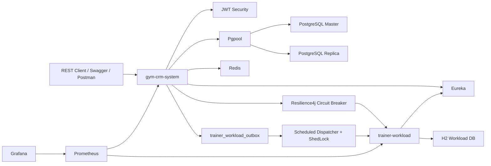

# Gym CRM Microservices

Gym CRM is a Spring Boot microservices training project for managing gym
trainees, trainers, trainings, authentication, trainer workload summaries,
monitoring, and resilience scenarios.

This is a monorepo. GitLab renders this root `README.md` as the project
documentation.

## Modules

* `gym-crm-system` - main service. Manages trainees, trainers, trainings,
  authentication, PostgreSQL persistence, Redis-backed security state, metrics,
  and integration with trainer workload.
* `trainer-workload` - workload service. Stores trainer monthly workload
  summaries in H2 and exposes update/query endpoints.
* `eureka` - Spring Cloud Netflix Eureka discovery server.
* `infra` - PostgreSQL initialization scripts and Prometheus/Grafana
  configuration.
* `docker-compose.yml` - local deployment model for all services.

## Architecture



## Key Features

* Trainee and trainer profile creation, authentication, profile updates, status
  switching, and password changes.
* Training creation, deletion, and training history queries.
* Trainer assignment for trainees.
* Stateless JWT bearer authentication.
* Redis-backed failed login attempt tracking and JWT revocation.
* Spring Data JPA persistence for the main service.
* H2 persistence for `trainer-workload`.
* Eureka service discovery.
* Service-to-service JWT for internal workload calls.
* Resilience4j circuit breaker around `trainer-workload` calls.
* Custom outbox retry flow for failed workload updates.
* ShedLock for single-node execution of the scheduled outbox dispatcher in
  multi-replica deployments.
* Idempotency records in `trainer-workload` to ignore duplicate workload
  events.
* Correlation-id based tracing through `X-Transaction-Id` and log pattern
  `tx:<id>`.
* Actuator, Prometheus, and Grafana monitoring.
* Maven, JUnit, Mockito, Testcontainers, Checkstyle, and JaCoCo verification.

## Requirements

* Java 25
* Maven 3.9+
* Docker or Podman with Docker-compatible CLI
* Optional: Newman for running Postman collections from terminal

## Local Environment

Create `.env` from the example file.

Linux/macOS:

```bash
cp .env.example .env
```

PowerShell:

```powershell
Copy-Item .env.example .env
```

The committed `.env.example` contains local demo values only. Real secrets
should stay in ignored `.env` files.

## Run The Full Stack

Linux/macOS:

```bash
docker compose up -d --build
```

PowerShell:

```powershell
docker compose up -d --build
```

Check containers.

Linux/macOS:

```bash
docker compose ps
```

PowerShell:

```powershell
docker compose ps
```

Useful URLs:

```text
Eureka:                    http://localhost:8761
Gym CRM Swagger UI:        http://localhost:8080/api/swagger-ui.html
Trainer Workload Swagger:  http://localhost:8081/api/swagger-ui/index.html
Gym CRM health:            http://localhost:8080/api/actuator/health
Trainer Workload health:   http://localhost:8081/api/actuator/health
Prometheus:                http://localhost:9090
Grafana:                   http://localhost:3000
```

## Build And Verify

Run verification per service.

Linux/macOS:

```bash
cd gym-crm-system
mvn clean verify
cd ..
```

```bash
cd trainer-workload
mvn clean verify
cd ..
```

```bash
cd eureka
mvn clean verify
cd ..
```

PowerShell:

```powershell
Push-Location gym-crm-system
mvn clean verify
Pop-Location
```

```powershell
Push-Location trainer-workload
mvn clean verify
Pop-Location
```

```powershell
Push-Location eureka
mvn clean verify
Pop-Location
```

## Main API

Public endpoints:

```text
POST /api/v1/trainees
POST /api/v1/trainers
POST /api/v1/auth/login
```

Protected endpoints require:

```http
Authorization: Bearer <token>
```

Swagger UI:

```text
http://localhost:8080/api/swagger-ui.html
```

OpenAPI JSON:

```text
http://localhost:8080/api/v3/api-docs
```

## Trainer Workload API

Swagger UI:

```text
http://localhost:8081/api/swagger-ui/index.html
```

OpenAPI JSON:

```text
http://localhost:8081/api/v3/api-docs
```

`trainer-workload` endpoints are protected with the same JWT issuer/secret.
The main service calls workload endpoints with a service JWT.

## Resilience Flow

When a training is created or deleted, `gym-crm-system` sends a workload update
to `trainer-workload`.

If `trainer-workload` is available:

```text
training operation -> REST call -> workload summary updated
```

If `trainer-workload` is unavailable:

```text
training operation succeeds
failed workload update is stored in trainer_workload_outbox as PENDING
scheduled dispatcher retries later
after successful delivery, outbox status becomes SENT
```

The synchronous call is protected by a Resilience4j circuit breaker named
`trainerWorkload`. The retry dispatcher is protected by ShedLock, so only one
`gym-crm-system` replica dispatches outbox records at a time. The workload
service stores processed `(training_id, action_type)` events, making retries
idempotent.

## Logs And Tracing

Both services log `X-Transaction-Id` as `tx:<id>`.

Example:

```text
[tx:video-demo-001] ... REST request started ...
```

This is correlation-id based tracing through logs. It is not a full
OpenTelemetry/Zipkin/Jaeger distributed tracing setup.

Follow logs.

Linux/macOS:

```bash
docker logs -f gym-app
```

```bash
docker logs -f gym-trainer-workload
```

PowerShell:

```powershell
docker logs -f gym-app
```

```powershell
docker logs -f gym-trainer-workload
```

## Postman

Postman collections:

```text
gym-crm-system/postman/gym-crm-rest.postman_collection.json
gym-crm-system/postman/gym-crm-outbox.postman_collection.json
```

Optional Newman run:

Linux/macOS:

```bash
newman run ./gym-crm-system/postman/gym-crm-outbox.postman_collection.json
```

PowerShell:

```powershell
newman run .\gym-crm-system\postman\gym-crm-outbox.postman_collection.json
```

## Monitoring

Actuator endpoints:

```text
http://localhost:8080/api/actuator/health
http://localhost:8080/api/actuator/metrics
http://localhost:8080/api/actuator/prometheus
http://localhost:8081/api/actuator/health
http://localhost:8081/api/actuator/prometheus
```

Prometheus:

```text
http://localhost:9090
```

Grafana:

```text
http://localhost:3000
```

Default local Grafana credentials are configured in `.env.example`:

```text
admin / admin
```

## Demo Script

Use `presentation.md` for the video recording checklist. It contains Swagger
payloads, Postman collection names, Linux terminal commands, log commands,
circuit breaker demo steps, and outbox SQL checks.
